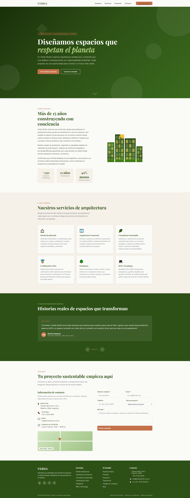
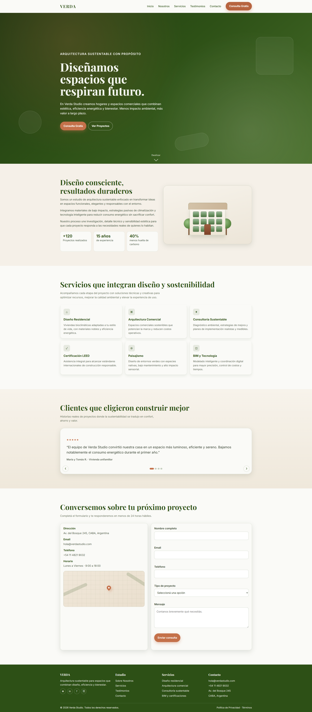

# PFO 02 — AI Landing Lab

Trabajo Práctico N° 2 · Tecnicatura en Programación · Frontend · ITFS 29

---

## Datos del estudiante

| Campo | Dato |
|---|---|
| **Nombre y apellido** | Gastón Zampar |
| **Materia** | Desarrollo de Sistemas Web (Front End) - 2° D |
| **Institución** | ITFS 29 |
| **Año** | 2026 |
| **Contacto** | zamparg@hotmail.com |

---

## Deploy

> **[→ Ver proyecto en vivo](https://pfo-2-frontend-itfs29-blush.vercel.app/)**
>
> *(Reemplazá el link cuando hagas el deploy en Vercel)*

La portada unificada contiene tres accesos:

| # | Descripción | Link relativo |
|---|---|---|
| 1 | Prompt utilizado (embebido en la portada) | `/` |
| 2 | Landing generada por **Claude Sonnet 4.6** | `/claude.html` |
| 3 | Landing generada por **GPT 4.1** | `/gpt.html` |

---

## Prompt utilizado

```markdown
## Rol
Sos un desarrollador front-end experto en landing pages modernas y visualmente
impactantes. Escribís HTML5 semántico, CSS3 y JavaScript vanilla de calidad
productiva: responsive, accesible (WCAG AA) y performante. No usás frameworks
externos salvo que se indique explícitamente.

## Contexto
Creá una landing page completa en un único archivo HTML para "Verda Studio",
un estudio de arquitectura sustentable que diseña espacios residenciales y
comerciales eco-friendly. Identidad visual: elegante, moderna, tonos tierra
(verde oscuro #2D5016, beige cálido #F5F0E8, terracota #C4714A, blanco roto #FAFAF7).
Tipografía: Google Fonts — "Playfair Display" para títulos, "Inter" para cuerpo.

## Tarea
Construí la landing completa con las siguientes 7 secciones en orden:

### 1. Header / Navegación
Navbar sticky, logo "VERDA" en Playfair Display, links de navegación,
botón CTA "Consulta Gratis" (terracota), menú hamburguesa funcional en mobile,
sombra suave al hacer scroll.

### 2. Hero
Alto 100vh, fondo degradado CSS en tonos verde oscuro (sin imágenes externas),
título principal, subtítulo, dos CTAs (primario relleno y secundario outlined),
formas geométricas animadas en el fondo, flecha de scroll animada.

### 3. Sobre Nosotros
Dos columnas (texto izq. / visual der.), filosofía del estudio, 3 contadores
animados al hacer scroll: +120 Proyectos · 15 años · 40% menos huella de carbono.
Ilustración de edificio construida solo con CSS (divs, bordes, gradientes).

### 4. Servicios
Grilla de 6 cards: Diseño Residencial, Arquitectura Comercial, Consultoría
Sustentable, Certificación LEED, Paisajismo, BIM y Tecnología.
Hover: elevación con sombra + borde superior terracota.

### 5. Testimonios
Carrusel JS sin librerías, 4 testimonios, flechas prev/next + puntos indicadores,
avance automático cada 5 segundos, pausa al hover, estrellas CSS en terracota.

### 6. Formulario de Contacto
Dos columnas: info de contacto + mapa placeholder CSS a la izquierda, formulario
a la derecha (Nombre, Email, Teléfono, Tipo de proyecto, Mensaje).
Validación client-side con feedback visual + mensaje de éxito al enviar.

### 7. Footer
Fondo verde oscuro, 4 columnas, íconos de redes sociales en Unicode,
barra de copyright con política de privacidad y términos.

## Requisitos técnicos
- Un único archivo: todo el HTML, CSS y JS dentro del mismo index.html
- Diseño mobile-first, breakpoints en 768px y 1024px
- Sin frameworks CSS externos
- Google Fonts solo vía etiqueta link
- Respetar prefers-reduced-motion
- HTML5 semántico con atributos ARIA en elementos interactivos
- Copy en español real, sin lorem ipsum
- Paleta de colores consistente en todas las secciones

## Formato de salida
Devolvé únicamente el contenido completo del archivo index.html.
Sin explicaciones antes ni después del código.
No truncar — implementación completa obligatoria.
```

---

## Capturas de pantalla

### Agente 01 — Claude Sonnet 4.6 (`claude.html`)



### Agente 02 — GPT 4.1 (`gpt.html`)



---

## Estructura del repositorio

```
PFO_02/
├── index.html        ← Portada con los 3 accesos
├── claude.html       ← Landing generada por Claude Sonnet 4.6
├── gpt.html          ← Landing generada por GPT 4.1
├── screenshots/
│   ├── claude-preview.png
│   └── gpt-preview.png
└── README.md
```

---

## Agentes utilizados

| # | Agente | Modelo | Proveedor |
|---|---|---|---|
| 1 | Claude Code | `claude-sonnet-4-6` | Anthropic |
| 2 | ChatGPT | `gpt-4.1` | OpenAI |

---

*Repositorio: [github.com/zamparg/PFO2_frontend_itfs29](https://github.com/zamparg/PFO2_frontend_itfs29.git)*
